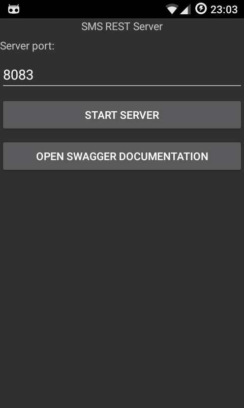
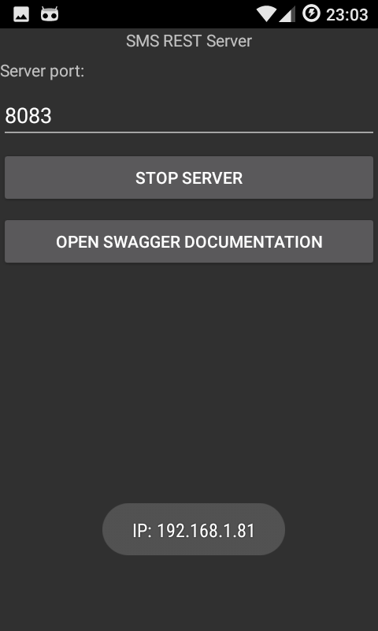
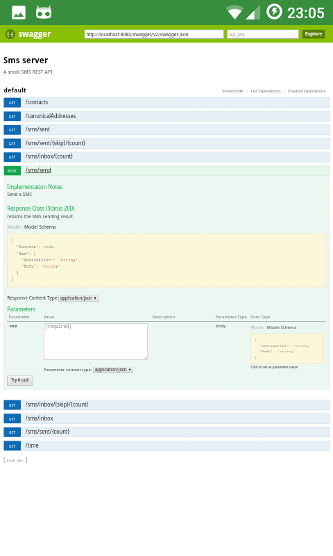
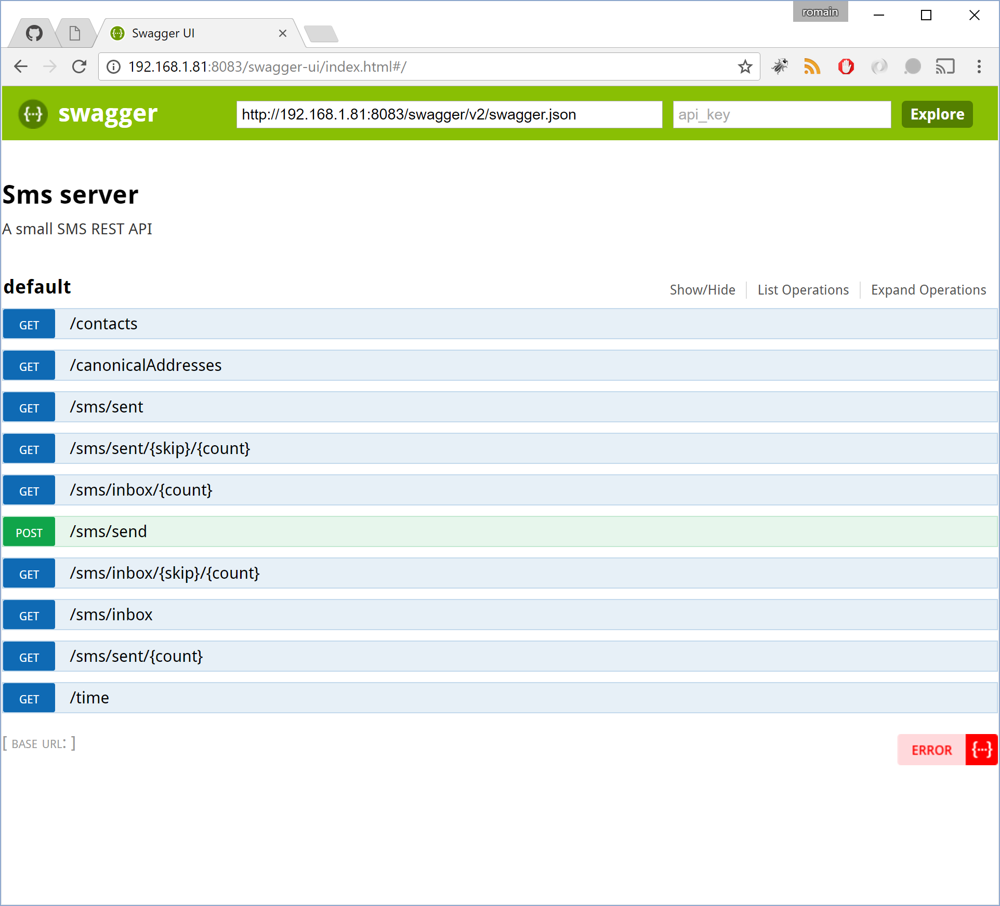

# SmsServer

There is small Xamarin App on Android hosting SMS Server written in FSharp and using the Suave library.

I use it to transform my old Android smartphones to SMS API endpoints for domotic and robotic personal projects.

## Getting started

- Download and install the APK from https://github.com/rflechner/SmsServer/releases 
- You can connect your phone to your private WIFI network
- Run the app
- Tap on "Start server" button
- Go to the swagger API documentation

### Starting the server

### Server started

### Swagger visible on your phone

### Swagger visible from a computer

